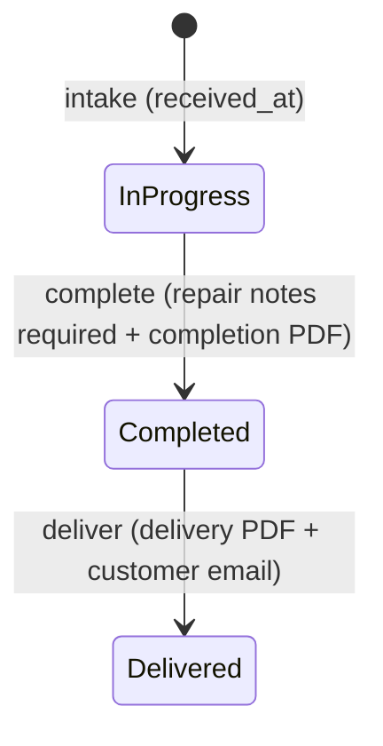
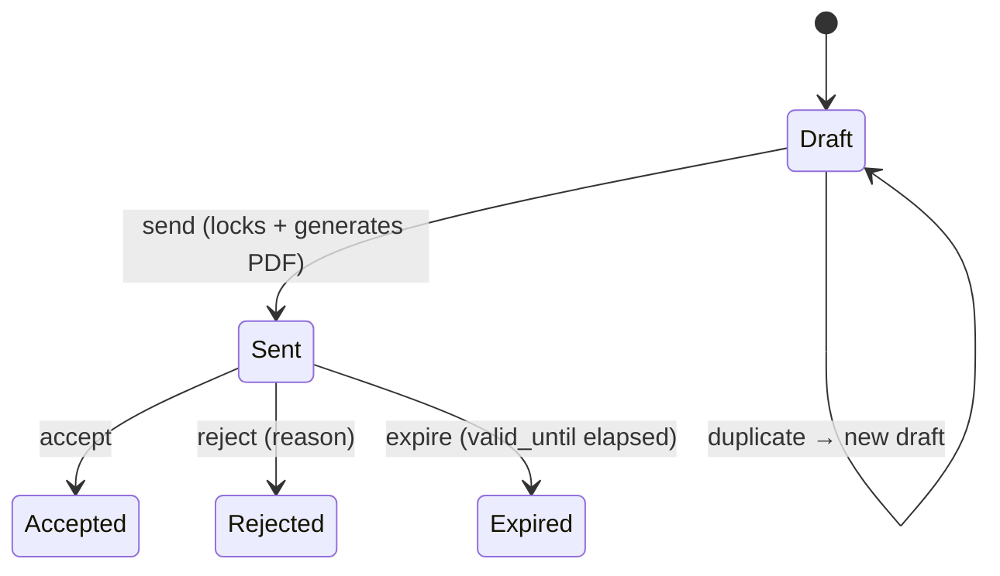

# Workflows

State machines for stateful records. Statuses are PHP enums; transitions run through action classes and are authorized per state. `Implemented` = live today; others are planned to these shapes (see the decision register).

## Tenant provisioning + licensing — Implemented

```mermaid
stateDiagram-v2
    [*] --> Provisioning: Tenant::create
    Provisioning --> Active: DB created + migrated + seeded
    Active --> Expired: license_expires_at passes
    Expired --> Active: admin renews
    Active --> Deleted: Tenant::delete (drops DB)
    Expired --> Deleted
```

## Task — dynamic board columns (Phase 11, reshaped by Phase 30)

> The fixed task state machine (start / submit-review / approve / reject /
> complete / reopen) was **replaced** by free movement across user-defined board
> columns (register `SM-dynamic-boards`). Jobs, workshop tickets and quotations
> keep their guarded machines — only tasks changed.

Every board has ordered **columns** (`board_columns`) that internal staff freely
add / rename / reorder / delete. A task moves to **any** column on its own board
through one guarded action, `MoveTaskAction` (`POST /tasks/{task}/move`) — there is
still **no generic "set status" endpoint**: the move names a `column_id`, and the
task's `status` + `completed_at` are *derived* from that column's `category`
(a `TaskStatus`: `todo` / `in_progress` / `review` / `completed`). A column change
appends an immutable `task_status_history` row, writes an activity-log entry, and
dispatches `TaskTransitioned` after commit; a pure reorder within one column does
not.

Default steps seeded on board creation: internal boards get **Yapılacak /
Devam Ediyor / Tamamlandı**; project boards also get **İncelemede** before "done".

| Action | Endpoint | Actor rule |
|--------|----------|-----------|
| Move a task to any step on its board | `POST tasks/{t}/move` | internal on any reachable board (`tasks.update`); **external** rep on their own project boards (`tasks.approve`) |
| Add a step | `POST boards/{b}/columns` | internal, `tasks.update` (`BoardPolicy@manageColumns`) |
| Rename / recategorize a step | `PUT columns/{c}` | internal, `manageColumns` |
| Reorder steps | `POST boards/{b}/columns/reorder` | internal, `manageColumns` |
| Delete a step | `DELETE columns/{c}` | internal, `manageColumns`; blocked if the step holds tasks or is the board's last step |

- **Customer approval is now movement.** Moving a task into a "done"-category step
  is how an external rep approves; moving it back out (e.g. review → in_progress)
  reads as a rejection and notifies the internal team. Column *management* stays
  internal-only, so customers still cannot reshape the board (preserves X1).
- **Derived status keeps everything coherent**: dashboards, global search and the
  notification listener still read `task.status`, kept in sync by every move.
- **External isolation** (unchanged): external reps reach only project boards they
  are a member of; internal boards and non-member project boards 403. Internal
  comments and attachments are filtered out of every external payload.
- **Cancel** is not modelled in the MVP; tasks are soft-deleted instead.

## Job — Implemented (Phase 13)

Field-service jobs (`app/Domain/Jobs`), driven exclusively by action classes —
no generic status setter. Start/end times are always taken from the **server**
clock. Statuses: `pending`, `in_progress`, `completed`, `canceled`.

```mermaid
stateDiagram-v2
    [*] --> Pending
    Pending --> InProgress: start (server time, repeat rejected)
    Pending --> Completed: — (not allowed; must start first)
    InProgress --> Completed: complete (requirements enforced)
    Pending --> Canceled: cancel (reason)
    InProgress --> Canceled: cancel (reason)
    Completed --> InProgress: reopen (managers)
    Canceled --> InProgress: reopen (managers)
```



| From | Endpoint / action | To | Rule |
|------|-------------------|----|------|
| Pending | `jobs/{j}/start` · StartJobAction | InProgress | records server `actual_start_at`; **repeat start rejected**; assigned technician (or manager) only |
| Pending/InProgress | `jobs/{j}` service-data · UpdateJobServiceDataAction | (same) | on-site notes; open jobs only |
| InProgress | `jobs/{j}/complete` · CompleteJobAction | Completed | **requirements**: min service-notes length, signature if `signature_required`, ≥1 photo if `photo_required`, (+ workshop constraint hook). Records server `actual_end_at`, computes duration, dispatches `JobCompleted` |
| Pending/InProgress | `jobs/{j}/cancel` · CancelJobAction | Canceled | reason recorded; `jobs.cancel` |
| Completed/Canceled | `jobs/{j}/reopen` · ReopenJobAction | InProgress | clears terminal timestamps; `jobs.cancel` (managers) |

- **Cancellation** is the recommended addition to the client's pending/in-progress/
  completed set — adopted as the MVP default (register J-cancel).
- **Completion requirements** are per-tenant settings (`jobs.signature_required`,
  `jobs.photo_required`, `jobs.min_service_notes`).
- **Photos** are stored privately, validated by content, compressed + thumbnailed
  asynchronously (GD). **Signatures** are captured on-canvas and stored as private
  PNG files — never as a Base64 blob in a column.
- **External** representatives can never access jobs (internal-only module).

## Workshop ticket — Implemented (Phase 15)

A device repair ticket (`app/Domain/Workshop`), action-driven, one device per
ticket. Statuses: `in_progress`, `completed`, `delivered` (the client's set — the
earlier diagnosing/awaiting-approval states were folded into `in_progress` for the
MVP). Timestamps are server-recorded.



| From | Action | To | Rule |
|------|--------|----|------|
| — | CreateWorkshopTicketAction | InProgress | resolves/creates the device; never reassigns another customer's serial |
| InProgress | CompleteWorkshopTicketAction | Completed | **repair notes required**; server `completed_at`; generates completion PDF; `WorkshopCompleted` |
| Completed | DeliverWorkshopTicketAction | Delivered | server `delivered_at`; generates delivery PDF; **queues customer email w/ PDF** (logged); `WorkshopDelivered` |

- **Device registry**: serials are unique per tenant (partial unique index; null
  when unavailable — no fake "N/A"). A serial belonging to another customer is
  **never silently reassigned** — intake rejects it and the lookup warns.
- **Job linkage** (`LinkWorkshopTicketToJobAction`): a job linked to an
  `in_progress` ticket **cannot complete** until the ticket is completed/delivered
  (`CompleteJobAction::assertWorkshopConstraints`). The job PDF lists linked
  workshop devices; the workshop PDF shows the job reference.
- **Internal-only** — external representatives never reach the workshop.
- Completed/Delivered are terminal (no reopen in the MVP).

## Quotation — Implemented (Phase 17)

Dynamic quotations (`app/Domain/Quotations`) with customer-facing aliases,
snapshot-preserving lines, and integer-money totals. Statuses: `draft`, `sent`,
`accepted`, `rejected`, `expired`, `canceled`.



| From | Action | To | Rule |
|------|--------|----|------|
| — | CreateQuotationAction | Draft | snapshots per line; totals computed server-side |
| Draft | UpdateQuotationAction | Draft | **sent/terminal quotations are locked** |
| Draft | SendQuotationAction | Sent | recomputes, stamps `sent_at`, generates the alias-only PDF |
| Sent | AcceptQuotationAction | Accepted | stamps `accepted_at` |
| Sent | RejectQuotationAction | Rejected | reason recorded |
| Sent | ExpireQuotationAction | Expired | manual, or `quotations:expire` daily when `valid_until` passes |
| any | DuplicateQuotationAction | new Draft | copies header + line snapshots verbatim, fresh number |

- **Snapshots**: each line keeps the item relation **and** the internal name,
  cost, sale price and tax at quotation time — later inventory changes never alter
  a historical quotation.
- **Money**: totals are computed in **integer minor units** (`App\Support\Money` +
  `QuotationCalculator`), never floats. Client previews are advisory; the server
  recomputes and persists (`RecalculateQuotationAction`).
- **Aliases**: the customer PDF shows only `customer_alias`. The internal name and
  cost are visible in-app only with `inventory.view_cost`.
- Job conversion from an accepted quote (Q5) remains a future enhancement.
